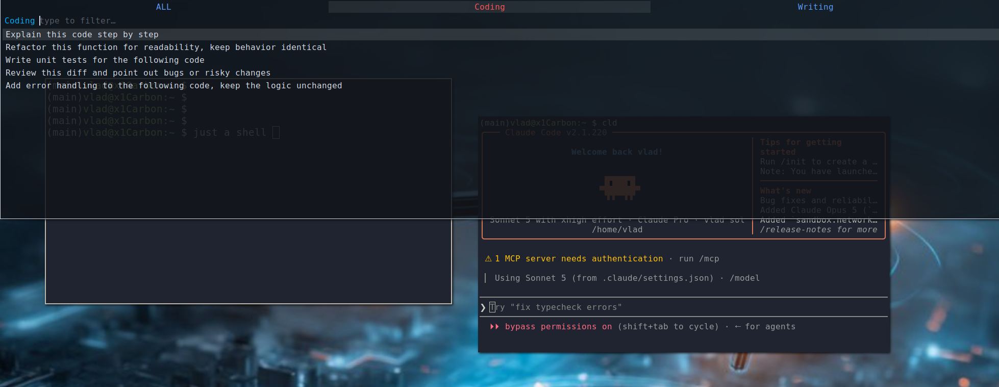

# paster — rofi-backed tabbed prompt paster for i3/X11

A Guake-style drop-down, semi-transparent, fuzzy-searchable menu of
reusable prompt lines (prompts, commands, boilerplate), organized in
**tabs**, built on **rofi**. Press the hotkey anywhere, pick a tab (or
search across all of them), type a few characters, hit Enter — the popup
closes, focus returns to the window you came from, and the chosen line is
pasted there.



No custom GUI app and no daemon: one rofi launch plus three short shell
scripts. rofi draws, places, and styles its own popup, so there is no
persistent process between toggles, no `for_window` rule, and transparency
degrades gracefully without a compositor (rofi falls back to
pseudo-transparency instead of going solid).

This is **v3**, the final version. Earlier development-stage versions
(v0–v2, fzf/alacritty-based) and the planning documents live in
[`devRef/`](devRef/README.md) for reference.

## Entries = folders (unchanged from v1)

**Each subfolder of `entries/` is a tab** (its name is the tab title), and
the `content.md` inside it holds the lines shown for that tab — one entry
per non-empty line:

```
entries/
├── 10_Coding/content.md     # tab "Coding"
├── 20_Writing/content.md    # tab "Writing"
└── 30_General/content.md    # tab "General"
```

- Tabs are ordered by folder name; a leading `NN_` number prefix is used
  only for ordering and is stripped from the displayed title.
- Folders without a `content.md` are ignored.
- Everything is rescanned on every toggle — add a folder or edit a
  `content.md` and it shows up on the next popup, no reload needed.
- An extra **ALL** tab (always first) searches every tab at once; entries
  there are shown as `[Tab]  line`.

## Requirements

- X11 session with **i3** (Wayland is not supported)
- `rofi` (≥ 1.6; Ubuntu 24.04 ships 1.7.5), `xdotool`, `xclip`, `xprop` —
  **the installer apt-installs whatever is missing**
- A compositor (picom) for true transparency; without one rofi uses
  pseudo-transparency

## Install

```sh
./install.sh              # hotkey from config.yaml, else $mod+p (Regolith) / Mod1+p (plain i3)
./install.sh 'Mod4+p'     # or pass any key bindsym accepts to pick your own
```

The installer:

1. Verifies X11/i3, checks the dependencies, and apt-installs missing ones.
2. Reads `config.yaml` (hotkey).
3. Wires the snippet into whichever config your session actually uses:
   - **Regolith i3** (detected via `~/.config/regolith3/i3/config.d/`) —
     writes a drop-in file `config.d/90_paster`.
   - **Plain i3** — seeds `~/.config/i3/config` from `/etc/i3/config` if
     missing, backs it up to `config.paster-backup`, and appends the block.
4. Removes previous paster blocks — **including v1/v0i3 blocks** — and
   closes their leftover popup window, so installing v3 cleanly supersedes
   older versions. Re-running is idempotent.

## Usage

- **Hotkey** — open the popup on the screen you're working on; press it
  again (or **Esc**) to close without pasting.
- **← / →** (or **Ctrl-h / Ctrl-l**, **Shift+←/→**, **Ctrl+Tab**) —
  previous / next tab. The text you typed is kept when switching tabs.
- **ALL** — the first tab searches every tab at once (`[Tab]  line`).
- Type to fuzzy-filter (fzf-style ranking), **Enter** — copy the line to
  the clipboard, close, refocus your previous window, and auto-paste there
  (`Ctrl+Shift+V` if that window is a known terminal, `Ctrl+V` otherwise).
  Every step after the clipboard is configurable — see the *Paste
  behavior* keys in `config.yaml` (`auto_paste: false` = clipboard only).

The popup reopens on the tab you last picked from.

### Differences from v1 worth knowing

- Because plain **←/→ switch tabs**, the cursor inside the filter text
  moves with **Ctrl-b / Ctrl-f** (emacs-style) instead of the arrows.
- ALL mode is a regular tab (always leftmost) instead of a Ctrl-a toggle.
- "Remembers the tab" means the tab of your **last pick** — closing with
  Esc keeps the previous memory (v1 remembered the tab you were looking at).
- rofi holds a keyboard grab while open, so the close-on-hotkey behavior is
  implemented *inside* rofi (the hotkey is added to its cancel keys, and
  automatically freed from any rofi default that used the same combo —
  e.g. `Ctrl+space` is rofi's row-select by default). If you set an exotic
  `hotkey` the translation may skip it — Esc always works.

## Front — the control plane (web GUI)

Besides the popup, the repo carries a small web service in the family's
VS Code shape (`control-plane/`, port **6012** on the bench) that edits
the same files the popup reads: add, edit, reorder, move and delete
entries and tabs; edit `config.yaml` with validation; open the real
popup on the laptop's screen from any view (the title-bar button); see
whether the hotkey is actually wired (Doctor) and re-run `./install.sh`
from the browser; a shell in the repo. There is no git view and no mock
of the popup: git stays in the shell, and the popup is the preview.
Reachable from a phone through mainBench.

```sh
./run.sh                    # venv + kits + webterm, then http://127.0.0.1:6012
./run.sh --public           # the tailnet (no auth — trusted networks only)
./deploy/systemd/install.sh # the `paster` systemd user unit
./run.sh --test             # the bash suite + pytest (80 % coverage gate)
```

The GUI **never changes the entry format**: one folder per tab, one
non-empty line per entry, `NN_` for order. Every write is atomic, refused
if the file changed meanwhile, and snapshotted first into
`~/.paster/history/` (50 per file); deleted tabs go to `~/.paster/trash/`.
Config values are replaced in place, so comments survive. Docs: the Help
view, or `man/` (start with `man/01-overview.md`); the plan is
`plans/pasterFrontPlan.md`.

## config.yaml — global settings

| key          | default   | meaning                                              |
|--------------|-----------|------------------------------------------------------|
| `hotkey`     | *(auto)*  | toggle key; empty = `$mod+p` Regolith / `Mod1+p` i3  |
| `width_pct`  | `100`     | popup width in % of the screen; `<100` is centered   |
| `height_pct` | `40`      | popup height in % of the screen, from the top        |
| `opacity_pct`| `85`      | `100` = solid, lower = more transparent              |
| `background` | `#10141a` | popup background color (`"#rrggbb"`)                 |
| `foreground` | `#d8dee9` | popup text color                                     |
| `font_size`  | `12`      | popup font size                                      |
| `border_px`  | `1`       | border around the popup (drawn by rofi), in pixels   |

Paste behavior (what Enter does after copying the line to the clipboard):

| key                  | default        | meaning                                                        |
|----------------------|----------------|----------------------------------------------------------------|
| `auto_paste`         | `true`         | send the paste keystroke; `false` = clipboard + refocus only   |
| `paste_delay_ms`     | `150`          | wait after refocusing before the keystroke (`0`–`5000`)        |
| `paste_key`          | `ctrl+v`       | keystroke for ordinary windows (xdotool `key` syntax)          |
| `terminal_paste_key` | `ctrl+shift+v` | keystroke for windows whose WM_CLASS is in `terminal_classes`  |
| `terminal_classes`   | *(see file)*   | `\|`-separated WM_CLASS names, matched case-insensitively      |
| `press_enter`        | `false`        | also send `Return` after the paste (submits in chat UIs; **runs** the line in a terminal); ignored when `auto_paste` is `false` |

Booleans accept `true/false`, `yes/no`, `on/off`, `1/0`. Any invalid value
falls back to its default with a `paster: config …` warning on stderr.

**Look and size keys apply on the next toggle, paste keys on the next
Enter** — the theme is re-rendered from `config.yaml` at every launch and
`paste-back.sh` re-reads the file on every paste, no reinstall needed (an
improvement over v1). Only `hotkey` needs `./install.sh` again, since it
lives in the i3 config.

## Layout

```
paster/
├── config.yaml                  # global settings (size, colors, hotkey, …)
├── entries/                     # one subfolder per tab
│   └── <NN_TabName>/content.md  #   one entry per line
├── bin/
│   ├── toggle.sh                # hotkey target: focus capture, theme render, rofi launch
│   ├── tab-mode.sh              # rofi script-mode backend (one instance per tab)
│   ├── paste-back.sh            # clipboard + focus-restore + paste keystroke (per config.yaml)
│   └── lib-config.sh            # config.yaml reader (sourced by toggle.sh, install.sh, paste-back.sh)
├── config/
│   ├── i3.conf.snippet          # keybinding (template; no window rule needed)
│   └── paster.rasi.tmpl         # rofi theme template, rendered per toggle
├── tests/
│   ├── run.sh                   # runs every test-*.sh (plain bash, no framework)
│   ├── test-config.sh           # config.yaml parsing + validation
│   ├── test-paste-back.sh       # paste-back.sh against stubbed xclip/xdotool/xprop
│   ├── test-toggle-list.sh      # toggle.sh --list-tabs (the labels the front asks for)
│   └── test_*.py, conftest.py   # the control plane's pytest suite
├── install.sh
├── run.sh                       # the front: venv, kit copy-ins, webterm, then the server
├── .port                        # the front's port (6012 on the bench)
├── control-plane/               # the front: server.py, modules/, static/ (kit copy-ins), templates/
├── deploy/systemd/              # the `paster` user unit (generated by its install.sh)
├── man/                         # the front's help pages (the Help view)
├── plans/                       # plans/pasterFrontPlan.md
├── README.md
└── devRef/                      # dev-stage reference: v0–v2 + planning docs
```

## Customization

- **Tabs / entries** — folders under `entries/`; picked up on the next
  toggle. Tab names should avoid `,` `:` `'` `"` (dropped from the label —
  they clash with rofi's mode syntax).
- **Everything visual** — `config.yaml`; applies on the next toggle.
- **Hotkey** — `config.yaml` + `./install.sh`, or `./install.sh '<key>'`.
- **Paste behavior** — `config.yaml`; applies on the next Enter.
  `auto_paste: false` turns paster into a pure clipboard picker;
  `press_enter: true` submits the pasted prompt straight away.
- **Terminal detection** — apps that should receive `terminal_paste_key`
  (`Ctrl+Shift+V`) are listed in `terminal_classes` in `config.yaml`
  (matched case-insensitively against WM_CLASS; find a window's class with
  `xprop WM_CLASS`, second quoted value). To send the same keystroke
  everywhere, set `terminal_paste_key` equal to `paste_key`.
- **Tab-bar colors / theme details** beyond config.yaml —
  `config/paster.rasi.tmpl`.

## Troubleshooting

- **Paste lands nowhere** — the selection is always on the clipboard, so
  `Ctrl+V` manually; happens if the previous window closed meanwhile.
- **Paste keystroke arrives too early / gets swallowed** — tab-mode.sh
  waits for the rofi process to exit before pasting; if you see this,
  raise `paste_delay_ms` in `config.yaml`.
- **Nothing is pasted, but the clipboard is right** — check `auto_paste`
  in `config.yaml` (and look for `paster: config …` warnings by running
  `printf test | bin/paste-back.sh` from a terminal).
- **Wrong paste keystroke in some app** — add its WM_CLASS to
  `terminal_classes` (or remove it), or change `paste_key` /
  `terminal_paste_key`, in `config.yaml`.
- **Hotkey does nothing** — the front's Doctor view shows where the binding
  is (or is not) and can re-run the installer. By hand: check which config your i3 actually loads:
  `pgrep -a i3` shows the `-c <path>` it was started with (Regolith uses
  `/etc/regolith/i3/config` + `config.d` drop-ins, not `~/.config/i3/config`).
  Then confirm the paster block/drop-in is in the matching location and the
  chosen key isn't bound elsewhere.
- **Popup on the wrong monitor** — v3 asks rofi for "the monitor with the
  focused window" (`-monitor -4`); if your setup disagrees, try `-1`
  (focused monitor) or `-5` (monitor with the mouse) in `bin/toggle.sh`.
- **Old v0/v1 menu still opens** — its window survived in the scratchpad;
  re-run `./install.sh` (it closes leftover Paster windows).
- **Stale state** — `$XDG_RUNTIME_DIR/paster-prev-win`, `paster-last-tab`,
  and the rendered `paster.rasi` (fallback `/tmp`); all safe to delete.

## Tests

```sh
./tests/run.sh
```

Plain bash, no framework: `test-config.sh` feeds temp YAML files to
`lib-config.sh`, `test-paste-back.sh` runs `paste-back.sh` with stub
`xclip`/`xdotool`/`xprop`/`sleep` on `PATH` and checks the recorded calls,
`test-toggle-list.sh` runs `toggle.sh --list-tabs` on temp entry folders
with stub `rofi`/`xdotool` that record any call. None needs an X session.

The front's suite is pytest (`tests/test_*.py`, hermetic: a temporary copy
of `entries/` + `config.yaml`, a data dir under `tmp_path`, stub binaries):
`./run.sh --test` runs both suites and gates coverage at 80 %. Kit-contract
tests skip on a clone without `../solBench`; on a bench host a skip is a
failed check (`pytest -rs`).
